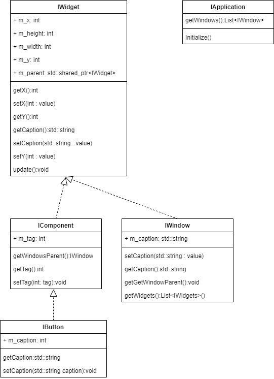

# INF1900 - Projeto Final

Esse projeto tem por objetivo a criação de um jogo de Truco em C++ que incorpora e demonstra de forma abrangente os princípios da Programação Orientada a Objetos (OO). O jogo de Truco deve ser totalmente funcional, com suporte para dois jogadores humanos e implementar todas as regras do jogo de Truco.
## Authors

- [@andersonmatheus1](https://www.github.com/andersonmatheus1)
- [@rottaveira](https://www.github.com/rottaveira)
- [@renanalencar](https://www.github.com/renanalencar)
- [@wandersonmedeiros2](https://www.github.com/wandersonmedeiros2)
## License

[MIT](https://choosealicense.com/licenses/mit/)

## Acknowledgements

Este projeto segue o Git Flow Workflow escrito por [Vicent Driessen](https://nvie.com/posts/a-successful-git-branching-model/). Se você não está familiarizado com esse fluxo, eu recomendo fortemente que leia o artigo original e o tutorial [Atlassian Git Flow Workflow](https://www.atlassian.com/git/tutorials/comparing-workflows/gitflow-workflow).
## Deployment

Para executar a aplicação é necessário modificar a costante `BASE_PATH = <SEU_DIRETORIO_DE_PROJETO/unicamp_inf1900_progamacao_cpp/M5/INF_1900_M5_Projeto_Final/truco` do arquivo `PathUtils.h` com o valor do caminho da pasta da aplicação em seu computador.

## Documentation

### Objetivos

Esse projeto tem por objetivo a criação de um jogo de Truco em C++ que incorpora e demonstra de forma abrangente os princípios da Programação Orientada a Objetos (OO). O jogo de Truco deve ser totalmente funcional, com suporte para dois jogadores humanos e implementar todas as regras do jogo de Truco.

### Requisitos

#### Requisitos Funcionais (RF)

- RF1. **Início do Jogo**: O sistema deve permitir o início de uma nova partida de Truco Paulista.
- RF2. **Distribuição de Cartas**: Automaticamente distribuir 3 cartas para cada jogador no início de cada rodada.
- RF3. **Manilhas**: Definir as manilhas com base na carta vira.
- RF4. **Apostas**: Permitir que os jogadores façam apostas (truco, seis, nove, doze) durante a rodada.
- RF5. **Contagem de Pontos**: Manter a contagem de pontos de cada dupla, visando o objetivo de 12 pontos para a vitória.
- RF6. **Turnos e Rodadas**: Gerenciar a ordem dos turnos dos jogadores e o avanço das rodadas.
- RF7. **Interface do Usuário**: Apresentar uma interface amigável que mostre a mão do jogador, a carta vira, e opções de ação.
- RF8. **Mão de Onze**: Aplicar regras especiais para a mão de onze.
- RF9. **Salvar e Carregar Partida**: Permitir salvar o estado atual do jogo e carregar um jogo salvo.
- RF10. **Finalização do Jogo**: Determinar o fim do jogo e declarar a dupla vencedora.

#### Requisitos Não Funcionais (RNF)

- RNF1. **Usabilidade**: Interface intuitiva e fácil de usar.
- RNF2. **Desempenho**: Respostas rápidas às ações do usuário, sem atrasos perceptíveis.
- RNF3. **Confiabilidade**: Capacidade de executar sem erros significativos e manejar exceções de maneira adequada.
- RNF4. **Manutenibilidade**: Código bem estruturado e documentado para facilitar atualizações e manutenção.
- RNF5. **Segurança**: Proteção contra manipulação ou acesso não autorizado às informações do jogo.
- RNF6. **Portabilidade**: Capacidade de operar em diferentes sistemas operacionais.

### Suposições

- Os jogadores estão familiarizados com as regras do Truco Paulista.
- A partida será jogada em um ambiente digital sem interação física com cartas.
- A conexão de rede não é necessária para jogos locais entre dois jogadores no mesmo dispositivo.
- Os jogadores aceitam o resultado do jogo gerado pelo sistema sem a necessidade de um árbitro humano.
- O sistema não precisa de funcionalidades de rede para jogar contra outros jogadores online no momento inicial do projeto.

### Diagramas

#### Diagrama de Classes

